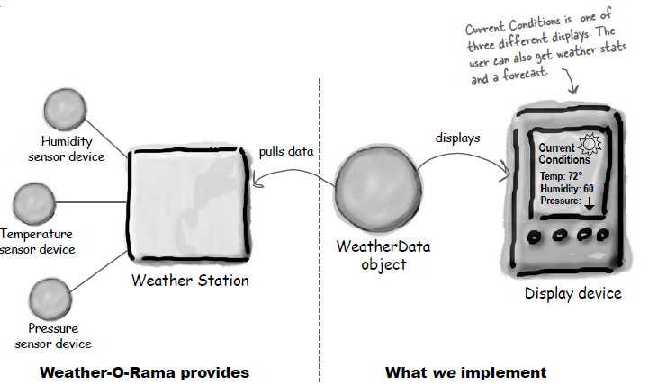
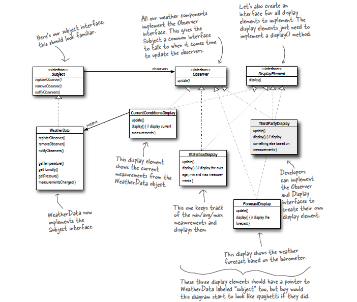
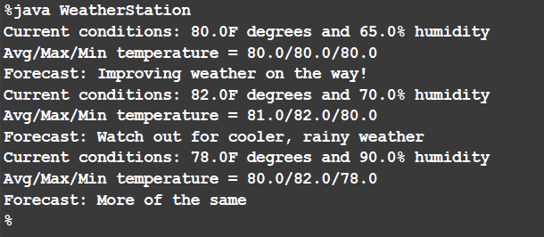

# ObserverPattern
Demo Weather Display Application Designed with Observer Pattern

This project is developed as a part of "Head First Design Patterns, Book by Elisabeth Freeman and Kathy Sierra". 
Aiming to show the implementation of "Observer Pattern".

The Observer Pattern defines a one-to-many dependency between objects so that when one object
changes state, all of its dependents are notified and updated automatically.
When the state of one object changes, all of its dependents are notified.

# Weather Station

 
 
The three players in the system are the weather station (the physical device that
acquires the actual weather data), the WeatherData object (that tracks the data coming
from the Weather Station and updates the displays), and the display that shows users
the current weather conditions.

 
 
The WeatherData object knows how to talk to the physical Weather Station, to get
updated data. The WeatherData object then updates its displays for the three different
display elements: Current Conditions (shows temperature, humidity, and pressure),
Weather Statistics, and a simple forecast.

 # Weather Station Output

 

